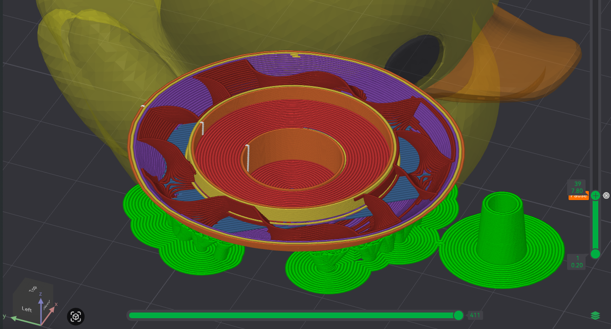

# octoprints

GitHub's all-star mascots, now ready to 3D print. [Rubber duck debugging](https://wikipedia.org/wiki/Rubber_duck_debugging) has never been so cute.

## Models

Each mascot has its own folder with STL files for printing, as well as optional 3MF files for multi-color prints and other optimized configurations.  Note that the original GitHub mascots have all been built by some incredibly talented 3D designers for on-screen use and then interpreted and adapted for FDM 3D printing by us hacks. Flaws and issues you find in the models are entirely our fault, but we welcome contributions if you have fixes you would like to see.

- [Mona](./models/mona) - The GitHub Octocat. Every developer's best friend forever.
- [Copilot](./models/copilot) - Your AI pair programmer to get stuff done.
- [Ducky](./models/ducky) - Always ready to listen but will never judge.

Within each folder, you'll find:
- An STL file which can be imported into any slicing software.
- A 3MF file configured for single-color printing with Bambu Studio.
- A 3MF file configured for multi-color printing with Bambu Studio.
   - See [_Multi-color printing_](#multi-color-printing) for more details.
- A 3MF file configured for multi-color printing with Bambu Studio along with voids to add items during printing.
   - See [_Additions During Printing_](#additions-during-printing) for more details.

If you print your own, we would LOVE to see it.  [Share your Octoprint builds here](https://github.com/martinwoodward/octoprints/discussions/categories/show-us-your-builds).  If you are coming along to [GitHub Universe 2025](https://githubuniverse.com/), feel free to bring some along to our Makerspace where we'll have some others that you might want to trade.

## Multi-color printing

We printed these models using [Bambu Studio](https://bambulab.com/en/download/studio) and a [Bambu Lab X1C printer](https://us.store.bambulab.com/products/x1-carbon) with an AMS (Automatic Material System). The 3MF files in each model's folder are set up for this printer and software, but you can adapt them for other multi-color printing setups.

> [!TIP]
> The nature of Bambu Lab's AMS means that there is a certain amount of filament waste when switching colors. We recommend carefully reviewing the slice results in Bambu Studio before printing to understand how much filament will be consumed. With dual nozzle printers like the [H2D](https://us.store.bambulab.com/products/h2d), the waste is much reduced but a great way to minimize the relative waste on a single nozzle printer is to print multiple copies of a model in a single print job. While the waste will be the same, it will be a smaller percentage of the total filament used.

Multiple colors not your jam? The mascots look great in a single color too. Maybe a bit of paint to add some details after printing? Go wild and share what you create with us! See [Filament Colors](#filament-colors) for our recommended colors.

## Additions During Printing

To make the printed models even more fun, we added a few extra touches you can include during the printing process. When printing the `*_with_voids.3mf` files, the print will pause at a specific layer to allow you to add items like magnets or washers into the model before resuming the print. Out of the box, we designed the models to accept:
1. 1/2 in. x 3/16 in. (12.7mm x 4.8mm) Ceramic Disc Magnet ([Available here](https://www.homedepot.com/p/Master-Magnet-1-2-in-x-3-16-in-Ceramic-Disc-Magnet-40-Pack-96764/204752646) & elsewhere)
2. 1/8 in. x 1 in. (3.2mm x 25.4mm) Washer ([Available here](https://www.homedepot.com/p/Everbilt-1-8-in-x-1-in-Zinc-Plated-Fender-Washer-100-Piece-800362/204276365) & elsewhere)

Adding the magnet and washer gives the models a nice weight and helps them stay upright on your desk or shelf. The magnet also allows you to attach the models to any magnetic surface, like a whiteboard or refrigerator.

> [!TIP]
> The space to add the magnet and washer is designed to be a bit larger than the actual items to make it easier to insert them during printing and avoid damage to the print nozzle. We've had great success adding a few drops of super glue onto the bottom void surfaces before inserting the magnet and washer to help keep them securely in place.

## Filament Colors

We used the following PLA filaments from Bambu Lab for our prints but you can use any brand, type, or color of filament you prefer.

- Mona
    - Purple: [PLA Basic - Purple](https://us.store.bambulab.com/products/pla-basic-filament?id=41884191752328)
    - Hot Pink: [PLA Basic - Hot Pink](https://us.store.bambulab.com/products/pla-basic-filament?id=565815336288092173)
    - Jade White: [PLA Basic - Jade White](https://us.store.bambulab.com/products/pla-basic-filament?id=41078274687112)
    - Black: [PLA Basic - Black](https://us.store.bambulab.com/products/pla-basic-filament?id=41078274654344)
- Ducky
    - Yellow: [PLA Basic - Yellow](https://us.store.bambulab.com/products/pla-basic-filament?id=40475106836616)
    - Pumpkin Orange: [PLA Basic - Pumpkin Orange](https://us.store.bambulab.com/products/pla-basic-filament?id=565815336288092167)
    - Black: [PLA Basic - Black](https://us.store.bambulab.com/products/pla-basic-filament?id=41078274654344)
- Copilot
    - Indigo Purple: [PLA Basic - Indigo Purple](https://us.store.bambulab.com/products/pla-basic-filament?id=565815336288092179)
    - Blue: [PLA Basic - Blue](https://us.store.bambulab.com/products/pla-basic-filament?id=41142110093448)
    - Bright Green: [PLA Basic - Bright Green](https://us.store.bambulab.com/products/pla-basic-filament?id=43045598167176)

## Other Awesome GitHub Themed 3D Printing Projects

Already printed your favorite mascots and looking for more? Check out these repos for your next print job to send to your printer.

- [martinwoodward/octolamp](https://github.com/martinwoodward/octolamp) - A 3D printed, GitHub infused, smart light.
- [chriswblake/github-copilot-lamp](https://github.com/chriswblake/github-copilot-lamp) - A fun and playful lamp to match the energy of GitHub Copilot.

## License
This project is licensed under the [Creative Commons Attribution-NonCommercial 4.0 International (CC BY-NC 4.0) License](https://creativecommons.org/licenses/by-nc/4.0/). You are free to share and adapt the material, but not for commercial purposes, and you must give appropriate credit, provide a link to the license, and indicate if changes were made.

The mascots are used with permission of GitHub. Use of GitHub trademarks or logos must not cause confusion or imply GitHub sponsorship or affiliation. Any use of third-party trademarks or logos are subject to those third-party's policies.

